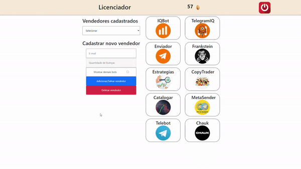
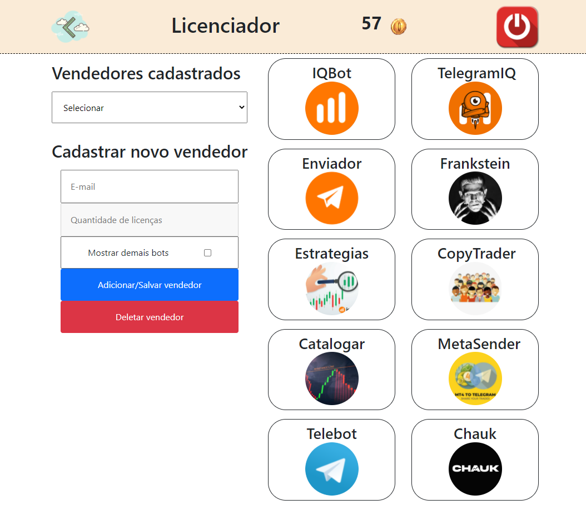
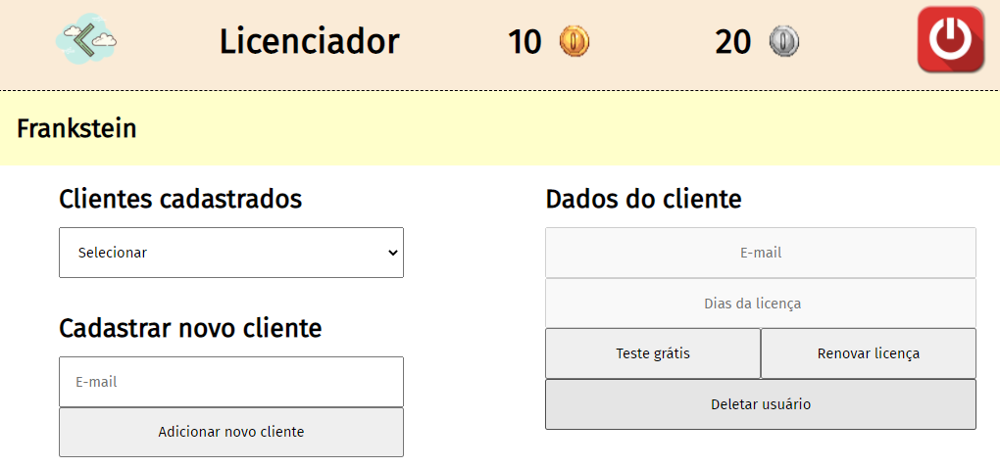

# [Licenciador para Bots](http://www.chaukbot.tk/)

<p align="center">
  
</p>

## 💻 O que é o projeto?

<p> 
  Sistema de gerenciamento de vendedores e clientes. Um ADM pode cadastrar e remover vendedores, escolhendo quais 'softwares' o vendedor poderá revender (ocultando ou não dos demais softwares). Em versões anteriores, o administrador também pode escolher o número de licenças que cada vendedor terá.
</p>
<p>
  Os vendedores por sua vez, criar, renovar e remover licenças dos softwares outorgados pelo administrador. Em versões anteriores, essas licenças eram limitadas no máximo de 31 dias.
<p>

## :rocket: Tecnologias


O projeto nasceu inicialmente em HTML/CSS/JS. Depois passou a ser desenvolvido em NodeJS utilizando Express. Mas na versão atual é desenvolvido em [NextJS](https://nextjs.org/) com typescript.

O backend é feito com a API serverless do próprio NextJS, e o banco de dados é o [MongoDB](https://www.mongodb.com/).

<p>
   
  
</p>

## Como rodar o projeto?

Clone o projeto em seu computador, crie no frontend um arquivo `.env` com a conexão do seu MongoDB para a conexão, e a palavra secreta do token JWT: 
```bash
MONGODB_URI = mongodb+srv://
SECRET = p"´@na{>
```

o **MONGODB_URI** é obtido através do MongoDB na opção de conectar ao cluster criado, enquanto o **SECRET** é criado pelo próprio desenvolvedor, conquanto que seja forte. Por fim, inicie o projeto:
```bash
cd frontend
yarn install
yarn dev
```

Assim que o processo terminar, abra no seu navegador a página `localhost:3000`.

### Collections no MongoDB e dados

Em teoria as collections serão criadas automaticamente pelo MongoDB, mas ainda assim, você pode verificar as collections que serão criadas na pasta de [models](./frontend/models/), que são:

- **Bots**: armazena os dados dos bots cadastrados, [ver Bot Schema](#bot-schema).
- **Clients**: armazena os dados dos clientes cadastrados, [ver Client Schema](#client-schema).
- **Users**: armazena os dados das operações por usuário, [ver Users Schema](#users-schema).
- **Sellers**: armazena os dados dos vendedores/ADMS cadastrados, [ver Seller Schema](#sellers-schema).
- **History**: armazena os eventos do sistema, [ver History Schema](#history-schema).

**Importante**
É necessário registrar o primeiro ADM no sistema o qual será um documento na collection de sellers com os seguintes campos:
```json
{
  "_id": ObjectId('...'), // id gerado automaticamente
  "email": "EMAIL_DO_ADMINISTRADOR", // email do ADM
  "password": "SENHA_CRIPTOGRAFADA", // senha criptografada em MD5
  "type": "admin" // Para ser identificado como ADM
}
```
**É importante** que a senha do ADM seja criptografada em MD5, pois o sistema utiliza essa criptografia para autenticar os usuários.

## API serverless

### Rotas sobre os BOTS

 - **GET** /api/bots/

    Devolve a lista de todos os bot com suas [informações](#bot-schema).

---

 - **GET** /api/bots/

    Devolve as [informações](#bot-schema) de um determinado bot.

GET **Query**:
```json
{
  "name": "",      // Nome do bot
}
```

---

 - **POST** /api/bots/

    Cria um novo bot no licenciador.

POST **Body**:
```json
{
  "name": "",       // Tag única do bot
  "title": "",      // Nome exibido
  "imageURL": "",   // URL da imagem exibida
  "extraInfo": {},  // Informações adicionais
}
```

Devolve o schema do [bot](#bot-schema) criado.
>> Admin role required.

---

 - **DELETE** /api/bots/

    Deleta um bot no licenciador.

DELETE **Body**:
```json
{
  "name": "", // Tag única do bot
}
```
Devolve o schema do [bot](#bot-schema) deletado.
>> Admin role required.

---

### Rotas sobre os CLIENTS

 - **GET** /api/clients/

    Devolve todos as informações principais de todos os 
    clientes de um determinado bot e vendedor.

GET **Query**:
```json
{
  "email": "",      // E-mail do vendedor
  "botName": "",    // Tag única do bot
  "isSeller": true, // Acessa este método
}
```
Devolve uma lista no formato:

```json
[
  {
    "email": "",    // Email do cliente
    "updateAt": "", // Data da última atualização
    "license": 0,   // Número de dias da licença
  }
]
```
>> Seller role required.

---

 - **GET** /api/clients/

    Recebe a quantidade de segundos restantes da licença de um
    determinado bot. A primeira senha chamada será a senha que
    ficará salva nas informações do cliente, bloqueando as
    próximas requisições se o cliente tentar outra senha (isso
    foi feito para o bot catalogador).

GET **Query**:
```json
{
  "email": "",        // E-mail do cliente
  "botName": "",      // Tag única do bot
  "password": "",     // Senha do cliente
  "isSeller": false,  // Acessa este método
}
```

Devolve o número de dias e uma mensagem, no formato:
```json
{
  "message": "",   // Mensagem dos dias de licença
  "timestamp": "", // Segundos restantes da licenças
}
```

---

 - **POST** /api/clients/

    Cria um novo cliente se não existir, ou adiciona uma nova
    licença à um cliente existente e atualiza a data de atualização.

POST **Body**:
```json
{
  "botName": "",      // Tag única do bot
  "sellerEmail": "",  // E-mail do vendedor
  "clientEmail": "",  // E-mail do cliente
}
```

Devolve as informações do novo cliente:
```json
{
  "email": "",    // E-mail do cliente
  "license": 0,   // Zero dias de licença (acabou de ser criada)
  "updateAt": "", // Data da última atualização
}
```
>> Seller role required.

---

 - **DELETE** /api/clients/

    Deleta uma licença ou um cliente, se já não houver
    licenças para deletar. Se a licença deletada estiver
    abaixo dos 7 dias de garantia, é devolvido uma licença
    ao vendedor.

DELETE **Query**:
```json
{
  "email": "",    // E-mail do cliente
  "seller": "",   // E-mail do vendedor
  "botName": "",  // Tag única do bot
}
```

Devolve um schema do [cliente](#client-schema) deletado.
>> Seller role required.

---

### Rotas sobre o HISTORY

 - **GET** /api/history/

    Devolve uma lista de [eventos](#history-schema).

>> Admin role required.

---

 - **DELETE** /api/history/

    Deleta todos os eventos de um determinado vendedor/data.

DELETE **Query**:
```json
{
  "when": "",    // Data máxima dos eventos
  "email": "",   // E-mail do vendedor
}
```

>> Admin role required.

---

### Rotas sobre as LICENSES

 - **POST** /api/licenses/

    Adiciona uma nova licença de um determinado bot (já cadastrado)
    na lista de bots do cliente. Atualizando o número de licenças
    ofertadas pelo vendedor e atualizando a data de atualização.

POST **Body**:
```json
{
  "botName": "",      // Nome do bot
  "sellerEmail": "",  // E-mail do vendedor
  "clientEmail": "",  // E-mail do cliente
  "licenseDays": "",  // Dias da licença
}
```

Devolve as seguintes informações:
```json
{
  "email": "",    // E-mail do cliente
  "license": 0,   // Número de dias da licença
  "licenses": 0,  // Licenças outorgadas pelo vendedor
  "updateAt": "", // Data desta atualização
}
```
>> Seller role required.

---

### Rotas sobre o LOGIN

 - **GET** /api/login/

    Verifica a autenticidade do token de usuário.

GET **Headers**:
```json
{
  "authorization": "",  // Token
}
```

Devolve as seguintes informações:
```json
{
  "email": "",      // E-mail do vendedor/admin
  "auth": false,    // Devolve se o token é válido
  "message": "",    // Mensagem de erro/sucesso
  "expiration": 0,  // Segundos restantes do token
}
```
>> Admin/Seller role required.

---

 - **POST** /api/login/

    Devolve o token de autenticação de um vendedor/admin. Se ainda não foi
    cadastrado uma senha, então é a senha dada será salva. O token dura 1h.

POST **Body**:
```json
{
  "email": "",     // E-mail do vendedor/admin
  "password": "",  // Senha do vendedor/admin
}
```

Devolve as [informações](#sellers-schema) do usuário e o token.

---

### Rotas sobre os SELLERS

 - **GET** /api/sellers/

    Devolve uma lista com todos os [vendedores](#sellers-schema).

>> Admin role required.

---

 - **POST** /api/sellers/

    Cria ou atualiza um vendedor, modificando os bots permitidos,
    e se ele pode ver os demais bots não permitidos.

POST **Body**:
```json
{
  "creatorEmail": "", // E-mail do admin
  "sellerEmail": "",  // E-mail do vendedor
  "botList": [],      // Lista de bots permitidos
  "showBots": false,  // Permissão para ver os outros bots
}
```

Devolve as [informações](#sellers-schema) do vendedor.
>> Admin role required.

---

 - **DELETE** /api/sellers/

    Deleta um vendedor.

DELETE **Query**:
```json
{
  "email": "",        // E-mail do vendedor
  "creatorEmail": "", // E-mail do admin
}
```

Devolve as [informações](#sellers-schema) do vendedor deletado.
>> Admin role required.

---

### Rotas sobre os Users

 - **GET** /api/users/

    Devolve as [informações](#users-view-schema) do usuário.

GET **Query**:
```json
{
  "email": "",   // E-mail do cliente
}
```

---

 - **POST** /api/users/

    Adiciona uma nova operação ao usuário, ou cria um novo usuário se
    ainda não existir. Se esta nova operação fizer ultrapassar o máximo
    de operações (10), então é deletado a operação mais antiga.

POST **Body**:
```json
{
  "email": "",          // E-mail do cliente
  "infos": "",          // Informações da operação
  "result": "",         // Resultado da operação
  "amount": 0,          // Valor da operação
  "botName": "",        // Tag única do bot
  "account": "",        // Conta DEMO/REAL
  "initialBalance": 0,  // Saldo inicial
  "additionalInfo": "", // Informações adicionais
}
```

Devolve as [informações](#users-schema) do usuário.
---

 - **DELETE** /api/users/

    Deleta um usuário.

DELETE **Query**:
```json
{
  "email": "",  // E-mail do usuário
}
```

Devolve as [informações](#users-schema) do usuário deletado.

---

## Schemas

<details markdown="1" 
  id = "bot-schema">
  <summary markdown="span">
    Bot Schema
  </summary>

  ```js
  {
    name: String,
    title: String,
    imageURL: String,
    extraInfo: Object
  }
  ```
</details>

<details markdown="1" 
  id = "license-schema">
  <summary markdown="span">
    License Schema
  </summary>

  ```js
  {
    botName: String,
    timestamp: Number
    updateTime: Number,
  }
  ```
</details>

<details markdown="1" 
  id = "client-schema">
  <summary markdown="span">
    Client Schema
  </summary>

  ```js
  {
    email: String,
    seller: String,
    license: Array[License],
    updateTime: Date,
    password: String
  }
  ```
  [License Schema](#license-schema)
</details>

<details markdown="1" 
  id = "history-schema">
  <summary markdown="span">
    History Schema
  </summary>

  ```js
  {
    when: Date,
    who: String,
    what: String,
  }
  ```
</details>

<details markdown="1" 
  id = "sellers-schema">
  <summary markdown="span">
    Sellers Schema
  </summary>

  ```js
  {
    email: String,
    type: String,
    password: String,
    licenses: Number, 
    showBots: Boolean, 
    botList: Array[String], 
  }
  ```
</details>

<details markdown="1" 
  id = "trade-schema">
  <summary markdown="span">
    Trade Schema
  </summary>

  ```js
  {
    botTitle: String,
    botName: String,
    account: String,
    result: String,
    amount: Number,
    infos: String,
    date: String,
  }
  ```
</details>

<details markdown="1" 
  id = "user-license-schema">
  <summary markdown="span">
    User License Schema
  </summary>

  ```js
  {
    botImg: String,
    botName: String,
    botTitle: String,
    remaining: String
  }
  ```
</details>

<details markdown="1" 
  id = "users-schema">
  <summary markdown="span">
    Users Schema
  </summary>

  ```js
  {
    email: String,
    createdAt: Date,
    totalYield: Number,
    trades: Array[Trade],
    initialBalance: Number,
    additionalInfo: Object,
  }
  ```
  [Trade Schema](#trade-schema)
</details>

<details markdown="1" 
  id = "users-view-schema">
  <summary markdown="span">
    Users View Schema
  </summary>

  ```js
  {
    email: String,
    createdAt: String,
    totalYield: Number,
    trades: Array[Trade],
    initialBalance: Number,
    additionalInfo: Object,
    licenses: Array[UserLicense],
  }
  ```
  [User License Schema](#user-license-schema)
</details>